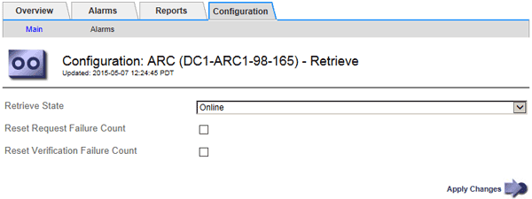

= 配置归档节点检索设置
:allow-uri-read: 
:icons: font
:imagesdir: ../media/

[role="lead"]
您可以配置归档节点的检索设置，将状态设置为联机或脱机，或者重置为关联警报跟踪的故障计数。

.开始之前
* 您将使用登录到网格管理器 link:../admin/web-browser-requirements.html["支持的 Web 浏览器"]。
* 您已拥有 link:admin-group-permissions.html["特定访问权限"]。

.步骤
. 选择 * 支持 * > * 工具 * > * 网格拓扑 * 。
. 选择 * 归档节点 * > * ARC/ * 检索 * 。
. 选择 * 配置 * > * 主 * 。
+

. 根据需要修改以下设置：
+
** * 检索状态 * ：将组件状态设置为：
+
*** 联机：网格节点可用于从归档介质设备检索对象数据。
*** 脱机：网格节点不可用于检索对象数据。

** 重置请求失败计数：选中此复选框可重置请求失败计数器。此选项可用于清除 ARRF （请求失败）警报。
** 重置验证失败计数：选中此复选框可重置检索到的对象数据的验证失败计数器。此操作可用于清除 ARRV （验证失败）警报。

. 选择 * 应用更改 * 。

