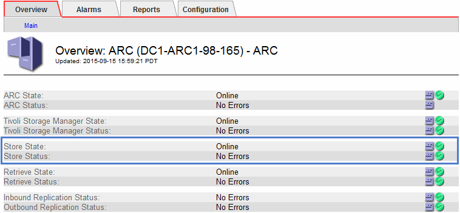

= 监控归档容量
:allow-uri-read: 
:icons: font
:imagesdir: ../media/

[role="lead"]
您不能通过StorageGRID 系统直接监控外部归档存储系统的容量。但是，您可以监控归档节点是否仍可将对象数据发送到归档目标，这可能表示需要扩展归档介质。

.关于此任务
您可以监控存储组件以检查归档节点是否仍可将对象数据发送到目标归档存储系统。存储故障（ ARVF ）警报还可能指示目标归档存储系统已达到容量，无法再接受对象数据。

.步骤
. 选择 * 支持 * > * 工具 * > * 网格拓扑 * 。
. 选择 * ：归档节点 _* > * 。 ARR>> 概述 >> 主系统 * 。
. 检查存储状态和存储状态属性以确认存储组件处于联机状态且无错误。
+

+
脱机存储组件或存在错误的组件可能指示目标归档存储系统无法再接受对象数据，因为它已达到容量。

