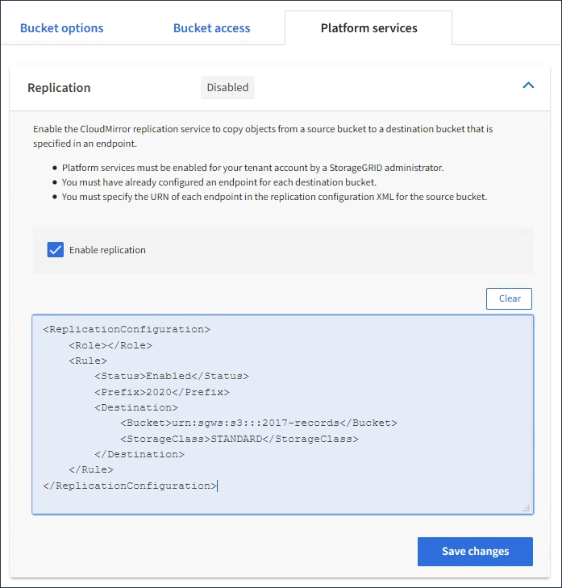

= 配置 CloudMirror 复制
:allow-uri-read: 
:icons: font
:imagesdir: ../media/

[role="lead"]
。 link:understanding-cloudmirror-replication-service.html["CloudMirror 复制服务"] 是三种 StorageGRID 平台服务之一。您可以使用 CloudMirror 复制将对象自动复制到外部 S3 存储分段。

.开始之前
* StorageGRID 管理员已为租户帐户启用平台服务。
* 您已创建一个存储分段以用作复制源。
* 要用作CloudMirror复制目标的端点已存在、并且您具有其URN。
* 您属于具有的用户组 link:tenant-management-permissions.html["管理所有分段或root访问权限"]。使用租户管理器配置存储分段时，这些权限会覆盖组或存储分段策略中的权限设置。

.关于此任务
CloudMirror 复制会将对象从源存储分段复制到端点中指定的目标存储分段。

NOTE: CloudMirror复制与跨网格复制功能有重要的相似之处和不同之处。要了解更多信息，请参见 link:../admin/grid-federation-compare-cgr-to-cloudmirror.html["请比较跨网格复制和CloudMirror复制"]。

要为存储分段启用CloudMirror复制、您必须创建并应用有效的存储分段复制配置XML。复制配置 XML 必须对每个目标使用 S3 存储分段端点的 URN 。

NOTE: 启用了 S3 对象锁定的源或目标分段不支持复制。

有关存储分段复制以及如何配置的常规信息、请参见 https://docs.aws.amazon.com/AmazonS3/latest/userguide/replication.html["Amazon Simple Storage Service (S3)文档：复制对象"^]。有关StorageGRID 如何实施GetBucketReplication、DeleteBucketReplication和PutBucketReplication的信息、请参见 link:../s3/operations-on-buckets.html["对存储分段执行的操作"]。

如果在包含对象的存储分段上启用CloudMirror复制、则会复制添加到该存储分段的新对象、但不会复制该存储分段中的现有对象。您必须更新现有对象才能触发复制。

如果在复制配置 XML 中指定存储类，则 StorageGRID 在对目标 S3 端点执行操作时会使用该类。目标端点还必须支持指定的存储类。请务必遵循目标系统供应商提供的任何建议。

.步骤
. 为源存储分段启用复制：
+
使用文本编辑器创建在 S3 复制 API 中指定的启用复制所需的复制配置 XML 。配置 XML 时：

+
** 请注意， StorageGRID 仅支持复制配置的 V1 。这意味着、StorageGRID 不支持使用 `Filter` Element中的规则、并遵循V1中有关删除对象版本的约定。有关详细信息，请参见有关复制配置的 Amazon 文档。
** 使用 S3 存储分段端点的 URN 作为目标。
** 也可以添加 `<StorageClass>` 元素、并指定以下项之一：
+
***  `STANDARD`：默认存储类。如果在上传对象时未指定存储类、则为 `STANDARD` 已使用存储类。
*** `STANDARD_IA`：(标准—不常访问。)对于访问频率较低但仍需要在需要时快速访问的数据、请使用此存储类。
*** `REDUCED_REDUNDANCY`：将此存储类用于存储冗余程度低于的非关键、可重现的数据 `STANDARD` 存储类。

** 如果指定 `Role` 在配置XML中、此参数将被忽略。StorageGRID 不使用此值。
+
[listing]
----
<ReplicationConfiguration>
    <Role></Role>
    <Rule>
        <Status>Enabled</Status>
        <Prefix>2020</Prefix>
        <Destination>
           <Bucket>urn:sgws:s3:::2017-records</Bucket>
           <StorageClass>STANDARD</StorageClass>
         </Destination>
     </Rule>
</ReplicationConfiguration>
----

. 从信息板中选择*查看存储分段*，或选择*存储(S3)*>*存储分段*。
. 选择源存储分段的名称。
+
此时将显示存储分段详细信息页面。

. 选择 * 平台服务 * > * 复制 * 。
. 选中*启用复制*复选框。
. 将复制配置 XML 粘贴到文本框中，然后选择 * 保存更改 * 。
+

+

NOTE: StorageGRID 管理员必须使用网格管理器或网格管理 API 为每个租户帐户启用平台服务。如果保存配置 XML 时发生错误，请联系 StorageGRID 管理员。

. 验证复制配置是否正确：
+
.. 向源存储分段添加一个对象，以满足复制配置中指定的复制要求。
+
在前面所示的示例中、将复制与前缀"2020"匹配的对象。

.. 确认对象已复制到目标存储分段。
+
对于小型对象，复制操作会快速进行。

.相关信息
link:creating-platform-services-endpoint.html["创建平台服务端点"]
