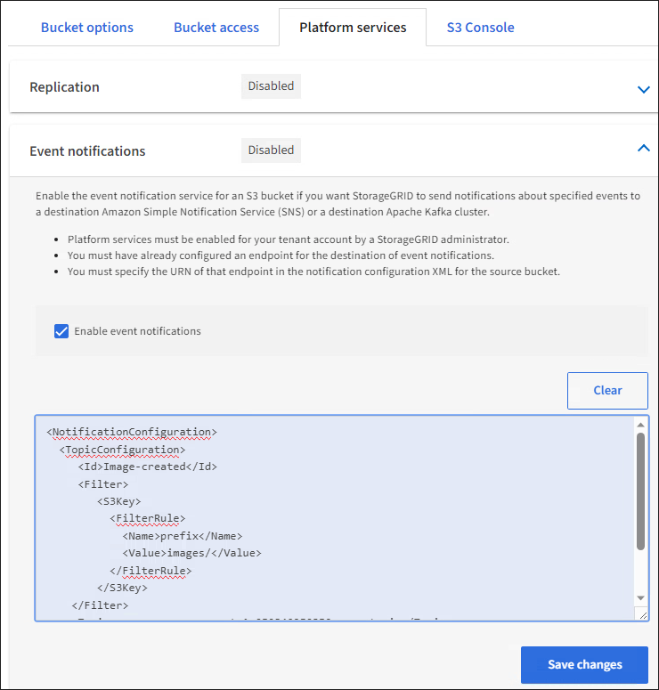

= 配置事件通知
:allow-uri-read: 
:icons: font
:imagesdir: ../media/

[role="lead"]
通知服务是三种 StorageGRID 平台服务之一。您可以为存储分段启用通知、以便将有关指定事件的信息发送到支持AWS Simple Notification Service (Amazon SNS)的目标Kafka集群或服务。

.开始之前
* StorageGRID 管理员已为租户帐户启用平台服务。
* 您已创建一个存储分段来用作通知源。
* 要用作事件通知目标的端点已存在、并且您具有其URN。
* 您属于具有的用户组 link:tenant-management-permissions.html["管理所有分段或root访问权限"]。使用租户管理器配置存储分段时，这些权限会覆盖组或存储分段策略中的权限设置。

.关于此任务
配置事件通知后、每当源存储分段中的对象发生指定事件时、系统都会生成通知并将其发送到用作目标端点的Amazon SNS或Kafka主题。要为存储分段启用通知，必须创建并应用有效的通知配置 XML 。通知配置 XML 必须使用每个目标的事件通知端点的 URN 。

有关事件通知以及如何配置这些通知的常规信息、请参见亚马逊文档。有关StorageGRID如何实施S3存储分段通知配置API的信息、请参见 link:../s3/index.html["有关实施 S3 客户端应用程序的说明"]。

如果为包含对象的存储分段启用事件通知，则仅会为保存通知配置后执行的操作发送通知。

.步骤
. 为源存储分段启用通知：
+
** 使用文本编辑器创建启用 S3 通知 API 中指定的事件通知所需的通知配置 XML 。
** 配置 XML 时，请使用事件通知端点的 URN 作为目标主题。
+
[listing]
----
<NotificationConfiguration>
  <TopicConfiguration>
     <Id>Image-created</Id>
     <Filter>
        <S3Key>
          <FilterRule>
            <Name>prefix</Name>
            <Value>images/</Value>
          </FilterRule>
        </S3Key>
    </Filter>
    <Topic>arn:aws:sns:us-east-1:050340950352:sgws-topic</Topic>
    <Event>s3:ObjectCreated:*</Event>
   </TopicConfiguration>
 </NotificationConfiguration>
----

. 在租户管理器中，选择 * 存储（ S3 ） * > * 分段 * 。
. 选择源存储分段的名称。
+
此时将显示存储分段详细信息页面。

. 选择 * 平台服务 * > * 事件通知 * 。
. 选中*启用事件通知*复选框。
. 将通知配置 XML 粘贴到文本框中，然后选择 * 保存更改 * 。
+

+

NOTE: StorageGRID 管理员必须使用网格管理器或网格管理 API 为每个租户帐户启用平台服务。如果保存配置 XML 时发生错误，请联系 StorageGRID 管理员。

. 验证是否已正确配置事件通知：
+
.. 对源存储分段中符合配置 XML 中配置的触发通知要求的对象执行操作。
+
在此示例中、每当使用创建对象时、都会发送事件通知 `images/` 前缀。

.. 确认已将通知发送到目标Amazon SNS或Kafka主题。
+
例如、如果您的目标主题托管在Amazon SNS上、则可以将此服务配置为在发送通知时向您发送电子邮件。

+
[listing]
----
{
   "Records":[
      {
         "eventVersion":"2.0",
         "eventSource":"sgws:s3",
         "eventTime":"2017-08-08T23:52:38Z",
         "eventName":"ObjectCreated:Put",
         "userIdentity":{
            "principalId":"1111111111111111111"
         },
         "requestParameters":{
            "sourceIPAddress":"193.51.100.20"
         },
         "responseElements":{
            "x-amz-request-id":"122047343"
         },
         "s3":{
            "s3SchemaVersion":"1.0",
            "configurationId":"Image-created",
            "bucket":{
               "name":"test1",
               "ownerIdentity":{
                  "principalId":"1111111111111111111"
               },
               "arn":"arn:sgws:s3:::test1"
            },
            "object":{
               "key":"images/cat.jpg",
               "size":0,
               "eTag":"d41d8cd98f00b204e9800998ecf8427e",
               "sequencer":"14D90402421461C7"
            }
         }
      }
   ]
}
----
+
如果在目标主题收到通知，则表示您已成功为 StorageGRID 通知配置源存储分段。

.相关信息
link:understanding-notifications-for-buckets.html["了解存储分段通知"]

link:../s3/index.html["使用S3 REST API"]

link:creating-platform-services-endpoint.html["创建平台服务端点"]
