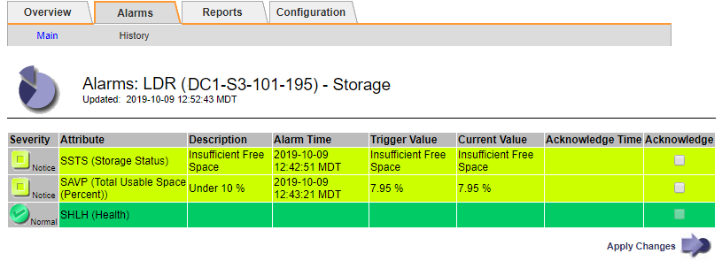
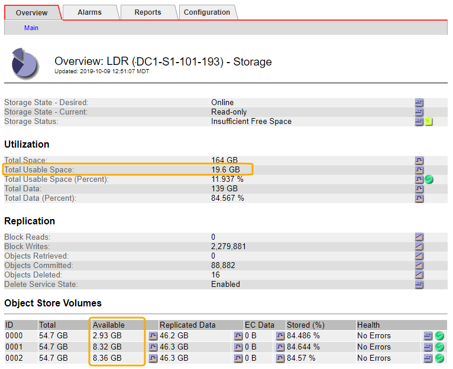

= 对存储状态（ SSTS ）警报进行故障排除
:allow-uri-read: 
:icons: font
:imagesdir: ../media/

[role="lead"]
如果存储节点的对象存储剩余可用空间不足，则会触发存储状态（ SSTS ）警报。

.开始之前
* 您必须使用登录到网格管理器 link:../admin/web-browser-requirements.html["支持的 Web 浏览器"]。
* 您已拥有 link:../admin/admin-group-permissions.html["特定访问权限"]。

.关于此任务
当存储节点中每个卷上的可用空间量降至存储卷软只读水印（ * 配置 * > * 系统 * > * 存储选项 * ）的值以下时， SSTS （存储状态）警报将在通知级别触发。

image::../media/storage_watermarks.png[存储选项概述]

例如，假设存储卷软只读水印设置为 10 GB ，这是其默认值。如果存储节点中的每个存储卷上的可用空间不足 10 GB ，则会触发 SSTS 警报。如果任何卷具有 10 GB 或更大的可用空间，则不会触发警报。

如果已触发 SSTS 警报，您可以按照以下步骤更好地了解问题描述 。

.步骤
. 选择 * 支持 * > * 警报（原有） * > * 当前警报 * 。
. 从服务列中，选择与 SSTS 警报关联的数据中心，节点和服务。
+
此时将显示网格拓扑页面。警报选项卡显示选定节点和服务的活动警报。

+

+
在此示例中，已在通知级别触发 SSTS （存储状态）和 SAVP （总可用空间（百分比））警报。

+

NOTE: 通常， SSTS 警报和 SAVP 警报会同时触发；但是，是否同时触发这两个警报取决于以 GB 为单位的水印设置和以百分比表示的 SAVP 警报设置。

. 要确定实际可用空间量，请选择 * LDR* > * 存储 * > * 概述 * ，然后找到总可用空间（ STAMP ）属性。
+

+
在此示例中，此存储节点上 164 GB 空间中只有 19.6 GB 可用。请注意，总计值是三个对象存储卷的 * 可用 * 值之和。之所以触发 SSTS 警报，是因为这三个存储卷中的每个卷的可用空间均小于 10 GB 。

. 要了解存储在一段时间内的使用情况，请选择 * 报告 * 选项卡，然后绘制过去几小时的总可用空间。
+
在此示例中，总可用空间从 12 ： 00 处的大约 155 GB 降至 12 ： 35 处的 20 GB ，这与触发 SSTS 警报的时间相对应。

+
image::../media/total_usable_space_chart.png[总可用空间 - 图表]

. 要了解存储的使用情况占总空间的百分比，请绘制过去几小时的总可用空间（百分比）。
+
在此示例中，总可用空间大约同时从 95% 下降到 10% 以上。

+
image::../media/total_usable_storage_percent_chart.png[总可用空间（百分比）—图表]

. 根据需要、 link:../expand/guidelines-for-adding-object-capacity.html["添加存储容量"]。
+
另请参见 link:../admin/managing-full-storage-nodes.html["管理完整存储节点"]。

